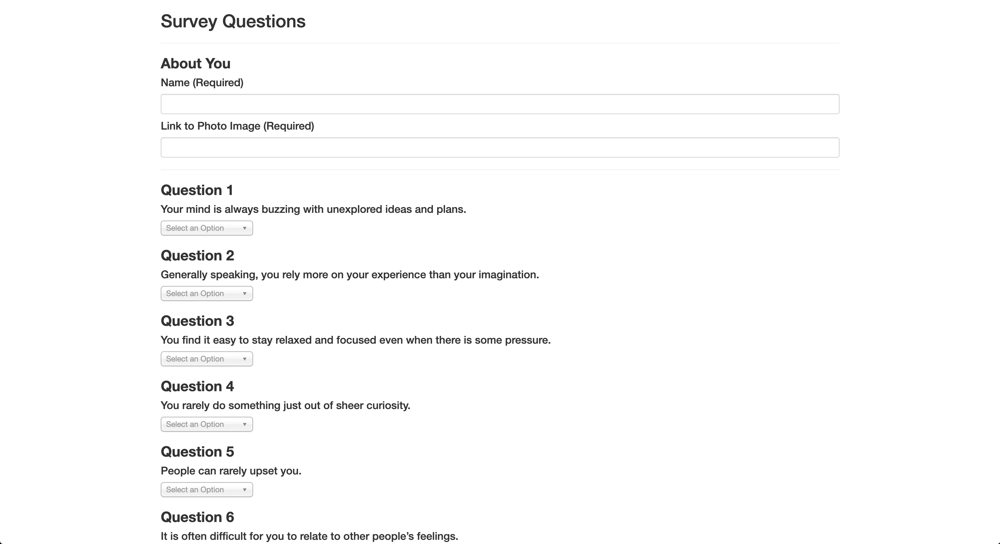
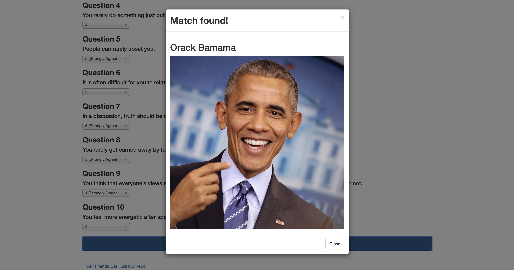

# <a href="https://boiling-ravine-17883.herokuapp.com">Friend Finder</a>  <a name="top"></a>

## Table of Contents <a name="toc"></a>

- [Overview](#overview)
- [How It Works](#how)
- [Technologies](#technologies)
- [Developer](#team)

---

## Overview <a name="overview"></a>

This full-stack web application provides a social networking platform via rudimentary matchmaking algorithm.

It take in results from users' surveys, then compares their answers with those from other users. The app will then display the name and picture of the user with the best overall match.

---

## How it works <a name="how"></a>

1. User visits the [deployed page](https://boiling-ravine-17883.herokuapp.com/).
   

2. User fills out a 10-question survey to provide data to find a match for.
   

3. `server.js` uses npm packages `express` and `path` to guide the user and process user input.

4. `htmlRoutes.js` file includes two routes:

   - A GET Route to `/survey` that displays the survey page.
   - A default, catch-all route that leads to `home.html` which displays the home page.

5. `apiRoutes.js` file contains two routes:

   - A GET route with the url `/api/friends`. This displays a JSON of all possible friends.
   - A POST route to `/api/friends`. This handles incoming survey results and the compatibility logic.

6. Data is save to `app/data/friends.js` as an array of objects. Each of these objects follows the format below.

```json
{
  "name": "Vault Boy",
  "photo": "https://screenrant.com/wp-content/uploads/2017/05/Fallout-Vault-Boy.jpg",
  "scores": [5, 1, 4, 1, 1, 1, 1, 1, 1, 1]
}
```

6. It determines the user's most compatible friend as follows:

   - Convert each user's results into a simple array of numbers (ex: `[5, 1, 4, 1, 1, 1, 1, 1, 1, 1]`).
   - With that done, compare the difference between current user's scores against those from other users, question by question. Add up the differences to calculate the `totalDifference`.
     - Example:
       - User 1: `[5, 1, 4, 1, 1, 1, 1, 1, 1, 1]`
       - User 2: `[3, 2, 6, 1, 1, 1, 1, 1, 1, 1]`
       - Total Difference: **2 + 1 + 2 =** **_5_**
   - The closest match will be the user with the least amount of difference.

7. The current user's most compatible friend is displayed as a modal pop-up that includes the friend's name and picture(if available).
   

<p align='right'><a href='#top'><sup>[Back to Top]</sup></a></p>

---

## Technologies <a name="technologies"></a>

| Technology/Dependency Used                                  | Purpose                        |
| ----------------------------------------------------------- | ------------------------------ |
| [Bootstrap](http://getbootstrap.com)                        | Styling                        |
| [Chosen jQuery plugin](https://harvesthq.github.io/chosen/) | Front End                      |
| [Font Awesome](https://fontawesome.com)                     | Styling                        |
| [Heroku](https://heroku.com)                                | Hosting                        |
| [jQuery](http://jquery.com)                                 | Front End                      |
| [Node.js](https://nodejs.org/en/)                           | JavaScript runtime environment |
| [NPM: Express](https://www.npmjs.com/package/express)       | Server                         |

<p align='right'><a href='#top'><sup>[Back to Top]</sup></a></p>

---

## Developer <a name="team"></a>

- [Danny Kim](https://github.com/danninemx)

<p align='right'><a href='#top'><sup>[Back to Top]</sup></a></p>
